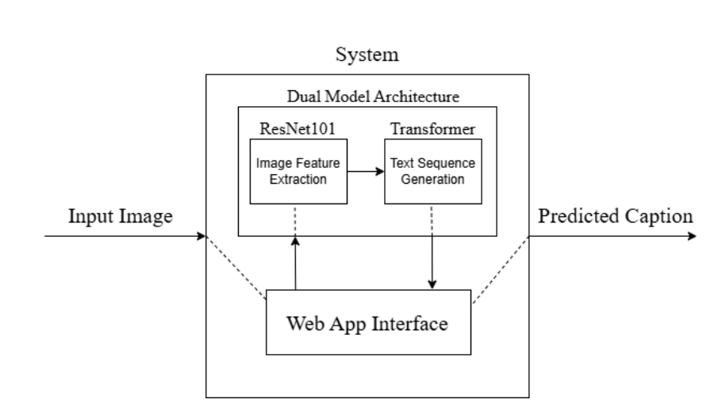
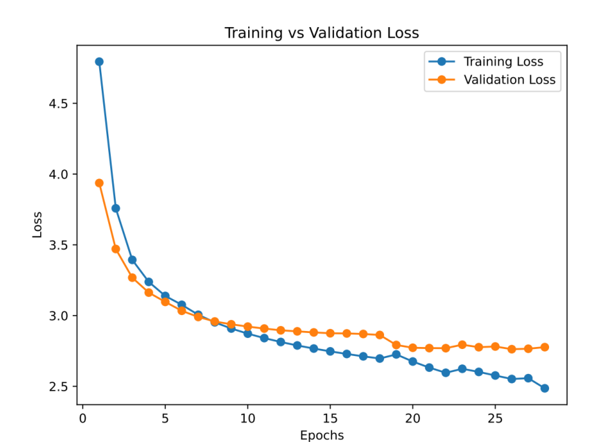

# ICRT — Image Captioning based on ResNet and Transformer

> An image captioning system that combines **ResNet-101** for visual feature extraction with a **Transformer-based decoder** for natural-language caption generation.

ICRT is a deep-learning image captioning project developed as a CNN–Transformer architecture and exposed through a **Streamlit web application**. Given an image, the system extracts spatial visual features using a modified ResNet-101 encoder and generates a contextually relevant caption using a Transformer decoder.

## ✨ Highlights

- 🖼️ Upload an image and generate an automatic natural-language caption.
- 🧠 **ResNet-101** extracts rich spatial visual features.
- 🔤 **Transformer decoder** converts visual features into a word sequence.
- 🎯 Multi-head self-attention captures relationships across image features and generated text.
- 📍 Positional encoding provides spatial/sequence position information.
- 🧾 **GloVe 6B 300D** pretrained word embeddings are used for textual representation.
- 🔎 **Beam search** improves caption generation by evaluating multiple candidate sequences.
- 💾 **MongoDB** stores generated captions and associated images/session results.
- 🌐 **Streamlit** provides the user-facing web interface.
- ✅ Image validation and error handling are included in the application.
- 🧪 Unit, integration, black-box, walkthrough, inspection, and performance testing were performed.
- ⚡ GPU inference is substantially faster than CPU inference according to the project evaluation.

---

## 🏗️ Architecture

The system follows a dual-model encoder–decoder pipeline:

```text
                         ICRT SYSTEM
                              │
                         Input Image
                              │
                              ▼
                    ┌───────────────────┐
                    │   Preprocessing   │
                    │ Resize / Normalize│
                    └─────────┬─────────┘
                              │
                              ▼
                    ┌───────────────────┐
                    │    ResNet-101     │
                    │  CNN Encoder      │
                    │ Feature Extraction│
                    └─────────┬─────────┘
                              │
                    Spatial Feature Map
                       (14 × 14 × 2048)
                              │
                              ▼
                    ┌───────────────────┐
                    │ Positional        │
                    │ Encoding          │
                    └─────────┬─────────┘
                              │
                              ▼
                    ┌───────────────────┐
                    │    Transformer    │
                    │      Decoder      │
                    │                   │
                    │ Multi-Head        │
                    │ Attention +       │
                    │ Feed Forward      │
                    └─────────┬─────────┘
                              │
                         Word Sequence
                              │
                              ▼
                       Beam Search
                              │
                              ▼
                    ┌───────────────────┐
                    │ Generated Caption │
                    └───────────────────┘
```

### System block diagram



The report describes the architecture as a web application in which the uploaded image is passed to ResNet-101 for feature extraction, after which the Transformer converts the extracted features into natural-language text. Positional encodings are added to the image features before Transformer processing.

---

## 🔬 Model Components

### 1. ResNet-101 Encoder

A pretrained ResNet-101 is used as the visual encoder. For captioning, the original classification-oriented final layers are removed so that the network retains spatial feature maps instead of class probabilities.

The modified encoder:

- Uses ResNet-101 residual blocks for hierarchical visual representation.
- Removes the final global average pooling and classification layers.
- Uses adaptive pooling to produce a fixed spatial representation.
- Produces an encoder output of approximately **`(batch_size, 14, 14, 2048)`**.
- Fine-tunes deeper convolutional blocks while retaining pretrained low-level features.

### 2. Transformer Decoder

The Transformer processes the visual representation and generates the caption token by token.

The decoder uses:

- Self-attention
- Multi-head attention
- Masked attention during autoregressive decoding
- Feed-forward layers
- Residual connections
- Layer normalization
- Positional encoding

The architecture is designed to capture long-range dependencies without the recurrence required by traditional RNN/LSTM-based captioning systems.

### 3. GloVe Embeddings

The project uses **GloVe 6B 300D** pretrained word embeddings. The embeddings provide a continuous vector representation of words and help capture semantic and syntactic relationships.

### 4. Beam Search

Beam search is used during inference instead of relying only on greedy decoding.

It maintains multiple candidate caption sequences and keeps the highest-scoring candidates at each decoding step. The report found that increasing the beam size produced more intricate captions, but also increased inference time.

---

## 📚 Dataset

### MS COCO

The main dataset used for the image-captioning experiments is **Microsoft Common Objects in Context (MS COCO)**.

The report describes MS COCO as:

- A large-scale image dataset for computer vision and image captioning.
- Containing diverse real-world scenes.
- Providing multiple human-written captions for each image.
- Particularly useful for learning relationships between objects and their surrounding context.
- Evaluated using the Karpathy train/validation/test splits.

The project initially experimented with smaller datasets such as Flickr8k during early development before moving to MS COCO for the larger implementation.

---

## ⚙️ Data Preprocessing

The preprocessing pipeline prepares both images and captions for model training.

### Image preprocessing

1. Images are resized to **256 × 256 × 3**.
2. Grayscale images are converted to three channels.
3. Images are transposed from HWC to CHW format for PyTorch.
4. ImageNet normalization is applied:

```text
Mean = [0.485, 0.456, 0.406]
Std  = [0.229, 0.224, 0.225]
```

5. Preprocessed images are stored efficiently using **HDF5**.

### Caption preprocessing

1. Captions are extracted and filtered.
2. A vocabulary/word map is created.
3. Words are converted into integer token IDs.
4. Special tokens are used:
   - `<start>`
   - `<end>`
   - `<unk>`
   - `<pad>`
5. Captions are padded to a consistent length.
6. A fixed random seed (`123`) is used to improve reproducibility.

---

## 🖥️ Application Features

### User Features

- Upload an image through the Streamlit interface.
- Validate supported image input.
- Automatically preprocess the uploaded image.
- Generate a descriptive caption.
- Display the generated caption.
- View previously generated results through session history.

### Model / Admin Features

- Collect and prepare captioning datasets.
- Split datasets into training, validation, and testing subsets.
- Build and train the ResNet-Transformer model.
- Evaluate model performance using captioning metrics.
- Fine-tune the ResNet encoder.
- Integrate the trained model into the web application.
- Store image-caption results in MongoDB.

### Reliability Features

- Input validation.
- Error handling.
- Unit testing of the CNN encoder.
- ResNet-101 / Transformer integration testing.
- Black-box testing with diverse images.
- Manual inspection and walkthrough of preprocessing and model components.
- Performance testing with different beam-search sizes.
- Session persistence through the database.

---

## 📊 Results

The final ICRT model used **ResNet-101 as the CNN encoder and a Transformer-based decoder**.

| Metric | Result |
|---|---:|
| Top-5 Accuracy | **84.86%** |
| Best BLEU-1 | **0.7336** |
| Best BLEU Epoch | **22** |
| Training Duration | **28 epochs** |
| Beam size 1 inference | **0.6122 s** |
| Beam size 5 inference | **1.0832 s** |
| CPU inference example | **3.9660 s** |

The report notes that BLEU scores decrease from BLEU-1 toward BLEU-4 because generating longer sequences accurately is more difficult.

### Training vs. validation loss



The training and validation losses decrease rapidly during the initial epochs. Around **epoch 17**, ResNet fine-tuning was enabled, after which the training and validation curves began to diverge. The report interprets this as a sign of potential overfitting. The highest BLEU score was obtained at **epoch 22**, after which additional training did not provide further improvement.

---

## 🧪 Testing

The system was evaluated using several levels of verification and validation:

### Unit Testing

The CNN encoder was tested to verify:

- Correct model initialization.
- Processing of sample batches.
- Expected output tensor dimensions.

### Integration Testing

The ResNet-101 encoder was integrated with the Transformer captioning model. The extracted feature vectors were successfully passed into the Transformer, producing coherent caption sequences.

An example reported during integration testing was:

> "a train is on the tracks near a river"

### Black-box Testing

The application was tested with different image inputs to evaluate:

- Caption relevance.
- Caption coherence.
- Image-context alignment.
- Streamlit interface behavior.
- Invalid file handling.
- Session persistence.

### Performance Testing

Inference time was evaluated using different beam-search sizes. A beam size of 1 produced faster inference, while beam size 5 generated more detailed captions at a higher computational cost.

GPU inference was substantially faster than CPU inference in the reported experiments.

---

## 🛠️ Technology Stack

| Category | Technologies |
|---|---|
| Language | Python |
| Deep Learning | PyTorch, Torchvision |
| Computer Vision | ResNet-101 |
| NLP / Caption Generation | Transformer, GloVe, NLTK |
| Web Application | Streamlit |
| Database | MongoDB |
| Numerical Computing | NumPy |
| Visualization | Matplotlib |
| Data Storage | HDF5 / h5py |
| Image Processing | ImageIO |
| Development | Jupyter Notebook |
| Version Control | Git |
| Compute Platforms | Google Colab, Kaggle Notebooks |

---

## 🔄 End-to-End Workflow

```text
1. Collect image-caption dataset
              ↓
2. Split into train / validation / test sets
              ↓
3. Preprocess images and captions
              ↓
4. Store preprocessed images using HDF5
              ↓
5. Extract visual features using ResNet-101
              ↓
6. Add positional information
              ↓
7. Generate captions using Transformer decoder
              ↓
8. Decode candidate sequences using Beam Search
              ↓
9. Evaluate using BLEU and Top-5 Accuracy
              ↓
10. Fine-tune / select the best model
              ↓
11. Integrate model with Streamlit
              ↓
12. Upload image → Generate caption → Store result
```

---

## 🎯 Applications

The project can be applied to:

- **Accessibility:** providing textual descriptions for visually impaired users.
- **E-commerce:** automatically generating product descriptions.
- **Social media:** assisting with image descriptions and content discovery.
- **Education:** generating descriptions for visual learning materials.
- **Real-time image analysis:** automatically describing visual content.
- **Image retrieval:** indexing images using generated natural-language descriptions.

---

## ⚠️ Limitations

The evaluation identified several limitations:

- More difficult and complex scenes remain challenging.
- Captions can lack grammatical richness.
- Longer caption sequences are harder to generate accurately.
- Fine-tuning the encoder introduced signs of overfitting after approximately epoch 17.
- Larger beam sizes improve observed caption quality but increase inference time.
- CPU inference is considerably slower than GPU inference, limiting practical real-time use on CPU-only systems.

---

## 🚀 Future Enhancements

The project report proposes:

1. **Multimodal Transformers** for stronger visual-textual feature fusion.
2. **Visual Question Answering (VQA)** using the existing model.
3. **Multilingual caption generation** based on user preferences.
4. Training on **specialized datasets** for domain-specific applications.
5. Extending the system to **video captioning**.
6. Using pretrained Transformers trained on larger vision-language datasets.
7. Exploring adaptive positional encoding.
8. Applying reinforcement-learning approaches such as **Self-Critical Sequence Training (SCST)** to improve caption quality.

---

## 📁 Suggested Repository Structure

```text
ICRT/
├── README.md
├── assets/
│   ├── architecture.png
│   └── training-validation-loss.png
│
├── app/
│   └── <streamlit application>
│
├── model/
│   ├── encoder/
│   ├── decoder/
│   └── checkpoints/
│
├── preprocessing/
│   ├── image_preprocessing/
│   └── caption_preprocessing/
│
├── notebooks/
│   └── experiments/
│
├── data/
│   └── <dataset files>
│
└── requirements.txt
```

> The exact filenames and directory structure should be adjusted to match the implementation in the repository.

---

## 📌 Project Objectives

- Extract meaningful visual information from input images.
- Generate descriptive and contextually relevant captions.
- Combine computer vision and natural language processing through a CNN–Transformer architecture.
- Provide a usable web interface for image caption generation.
- Evaluate the system quantitatively and qualitatively.

---

## 🏁 Conclusion

ICRT demonstrates a practical image-captioning pipeline that bridges **computer vision and natural language processing** using a ResNet-101 encoder and Transformer-based decoder. The model achieved **84.86% Top-5 Accuracy** and a best **BLEU-1 score of 0.7336 at epoch 22**, showing that the architecture can learn useful visual representations and convert them into relevant textual descriptions.

The evaluation also shows the trade-off between caption quality and inference speed when changing the beam-search size, as well as the importance of monitoring validation performance when fine-tuning the visual encoder. Overall, the project provides a promising foundation for automated image description and can be extended toward multimodal Transformers, VQA, multilingual captioning, specialized-domain captioning, and video captioning.

---

## 👥 Authors

**Kathmandu Engineering College — Department of Computer Engineering**

- Aabid Ali Mansoor
- Mahesh Acharya
- Merit Singh Suwal

Project: **ICRT — Image Captioning based on ResNet and Transformer**

---

## 📄 Project Report

This README is based on the ICRT project report submitted to the Department of Computer Engineering, Kathmandu Engineering College, Tribhuvan University.

**Code Number:** CT 654
